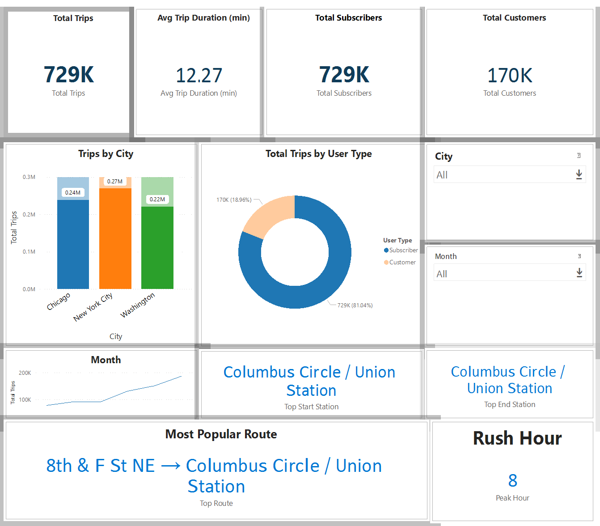
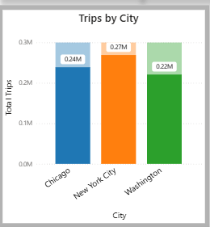
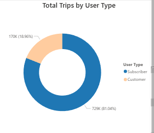

<p align="center">
  
</p>
 
# 🚴‍♂️ U.S. Bikeshare Analysis — Chicago, NYC, Washington

[]()


---

## 📌 Project Overview

This project explores bikeshare usage across **Chicago**, **New York City**, and **Washington**, using Python for EDA and Power BI for interactive visual analytics.

The analysis includes:

- Cleaning & preprocessing three separate datasets  
- Extracting time-based features (month, day, hour)  
- Understanding ridership behavior  
- Identifying differences between cities  
- Creating a final transformed dataset for Power BI dashboards  

This project demonstrates strong skills in:  
✔ Data Wrangling  
✔ Feature Engineering  
✔ Exploratory Data Analysis  
✔ Visualization (Matplotlib & Seaborn)  
✔ Storytelling & Dashboarding  
✔ Professional Documentation

---

## 📂 Repository Structure

```
bike-share-analysis/
│
├── data/
│   ├── chicago.csv
│   ├── new_york_city.csv
│   └── washington.csv
│
├── notebooks/
│   └── bikeshare_eda.ipynb
│
├── images/
│ ├── overview.png
│ ├── trips_by_city.png
│ ├── user_type.png
│
└── README.md
```

---

## 🧹 Data Cleaning & Feature Engineering

Each dataset required preprocessing to ensure consistency:

### ✔ Cleaning Steps

- Converted **Start Time** & **End Time** → datetime  
- Removed duplicate index columns  
- Fixed invalid or impossible age values  
- Standardized datatypes  
- Handled missing values (Washington missing gender/birth year)  
- Added `"Unknown"` for gender when missing  
- Replaced invalid birth years with median  

### ✔ Feature Engineering

Added new columns:

- `month`  
- `day_of_week`  
- `hour`  
- `trip_duration`  
- User-type information  

The final combined dataset contains:

### **900,000 rows × 12 high-quality features**

---

## 📊 Exploratory Data Analysis (Chicago Example)

### 1️⃣ **Time-Based Patterns**
- Summer months (June–August) show highest ridership  
- Weekday usage indicates strong commuting patterns  
- Rush-hour peaks at **7–9 AM** and **4–6 PM**

---

### 2️⃣ **Station Insights**
- **Streeter Dr & Grand Ave** is consistently the busiest station  
- Most common routes cluster around Chicago’s downtown & lakefront areas  

---

### 3️⃣ **Trip Duration**
- Majority of trips last **5–20 minutes**  
- Distribution is right-skewed due to a few long trips  

---

### 4️⃣ **Demographics**
- Majority riders are **Subscribers**  
- Males are the dominant gender in the dataset  
- Ages cluster between **28–42 years old**

---

## 🌆 Cross-City Comparison

### **Chicago & NYC**
- Strong, consistent commuter behaviors  
- Similar weekday/weekend ridership distribution  
- Higher proportion of Subscribers  

### **Washington**
- More tourist-oriented behavior  
- Fewer Subscribers  
- Missing demographic info required special handling  
- Daytime riding is more balanced across hours  

---

## 📊 Key Visual Insights (Power BI)

Below are the visuals included in the BI dashboard.

### 🔹 **Overview KPIs**

<p align="center">
  
</p>

### 🔹 **Trips by City**

<p align="center">
  
</p>

### 🔹 **User Type Breakdown**

<p align="center">
  
</p>

---

## 🧠 Key Findings

- Ridership peaks in **summer months**  
- Chicago & NYC show similar commuter behavior  
- Washington has more casual/tourist riders  
- **Subscribers** dominate (81% of all rides)  
- Peak riding hour = **5 PM (rush hour)**  
- Top stations are located in downtown/lakefront areas  

---

## 🛠️ Technologies Used

- **Python**: pandas, numpy, seaborn, matplotlib  
- **Jupyter Notebook**  
- **Power BI Desktop**  
- **GitHub**  
- **CSV-based datasets**  

---

## 📥 Dataset

The final transformed dataset for BI reporting:

📄 `bikeshare_final_powerbi.csv`

Includes:

- 900K rows  
- Cleaned & engineered features  
- Standardized across cities  
- Ready for dashboards & ML work  

---


## 🚀 Future Enhancements

- Integrate weather data for advanced trend analysis  
- Build forecasting models (ARIMA, Prophet, XGBoost)  
- Rider segmentation using clustering  
- Real-time station recommendation engine  
- Geospatial mapping for route optimization  

---

## 🧩 Author

**Ahmed Tarek**  
Data Analyst / Machine Learning Engineer 

---

